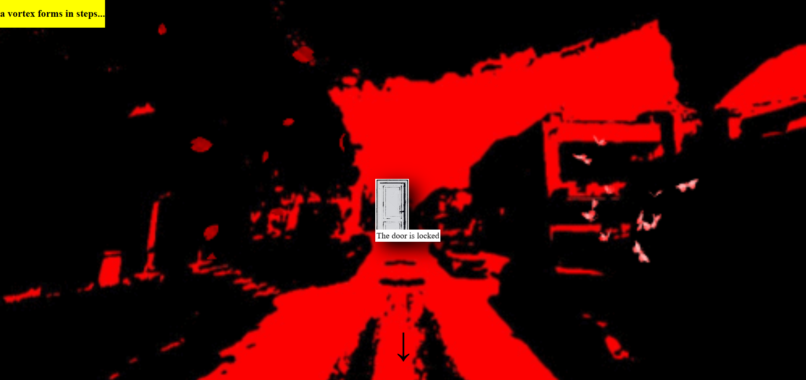
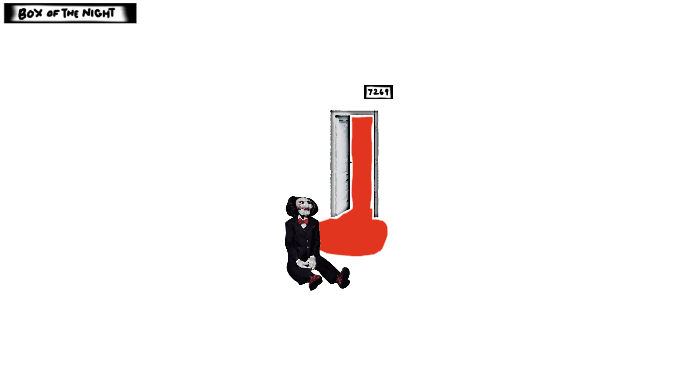
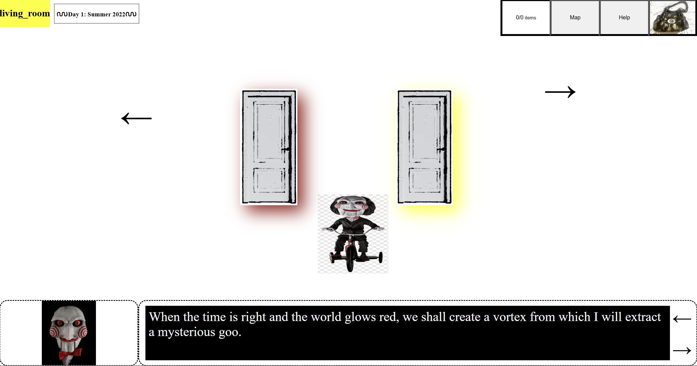
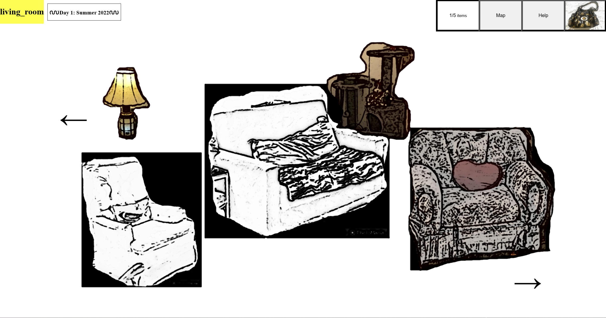
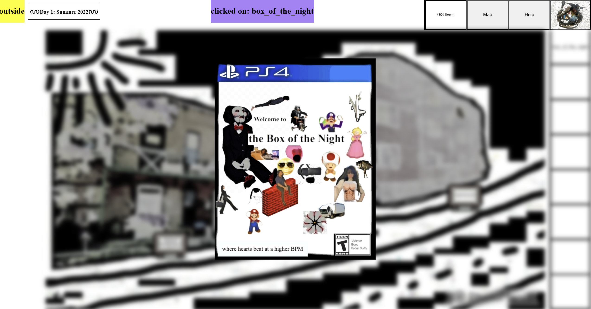
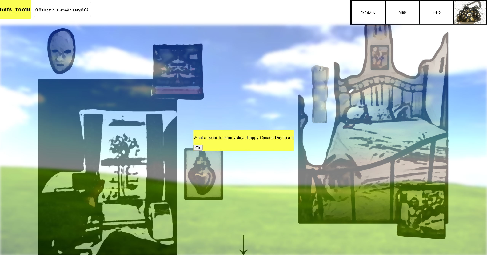
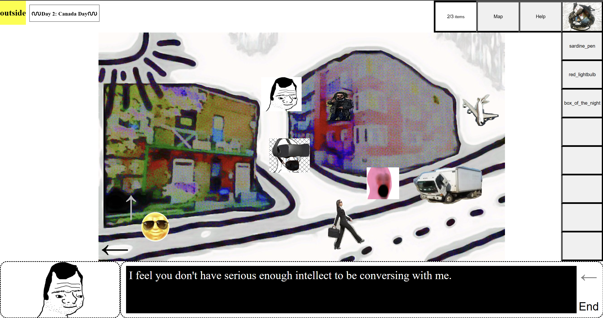
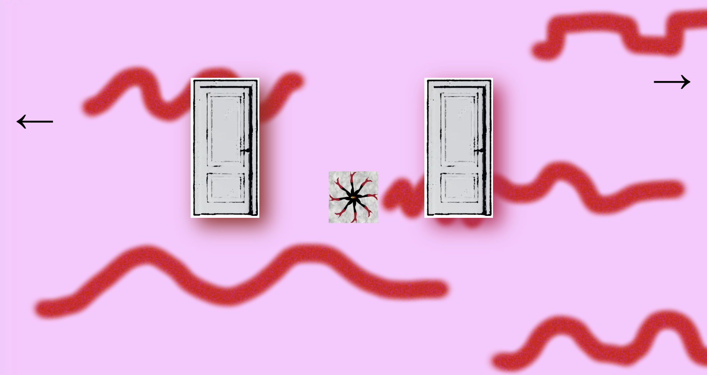
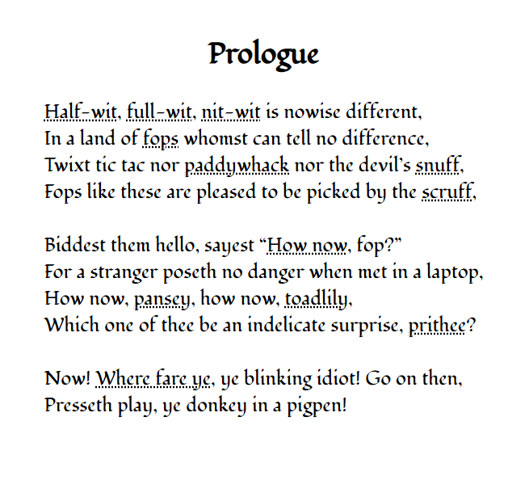

# boxofthenight

Welcome to Parc Ex.

Point and Click 2D web game.

Programming, Design, "Art", Writing by me. \
Music by Coil, Chris and Cosey, Yume Nikki Soundtrack, Faten Kanaan, Miss Kittin, etc. \
All characters are totally made up out of thin air, if you think that's you in there it's purely accidental.

I made this game for my ex but she never got to play it cuz we broke up on the day I was supposed to show it to her LOL.

So this is dedicated to my psycho ex gf that I loved 🤪
She is a Being of Light. My only solace is that she will continue to be.

Thank you for everything.

Source code is in a private repo, too cringe. Well, the code isn't cringe 😎 lol, but the content is. Made with React, Redux. It's a 2d game but I got some 3dverse and ThreeJS in there.

_spoilers_

1. a vortex forms in steps
   

2. start screen
   

3. dinky
   

4. living room
   

5. box of the night game case
   

6. waking up on canada day
   

7. outside
   

8. \[omitted]
   
9. \[omitted]
   

